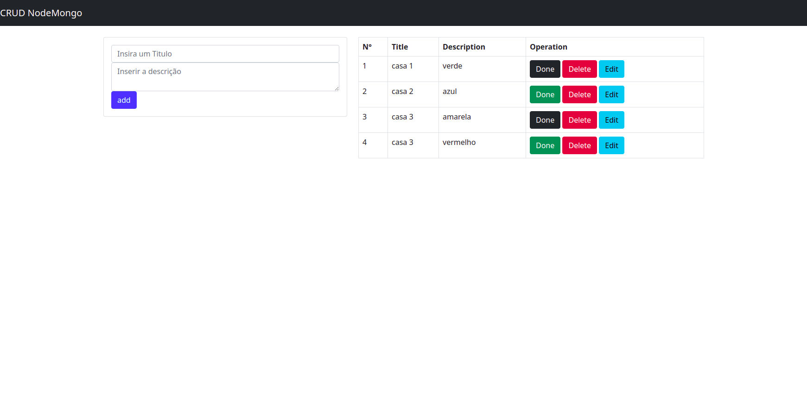
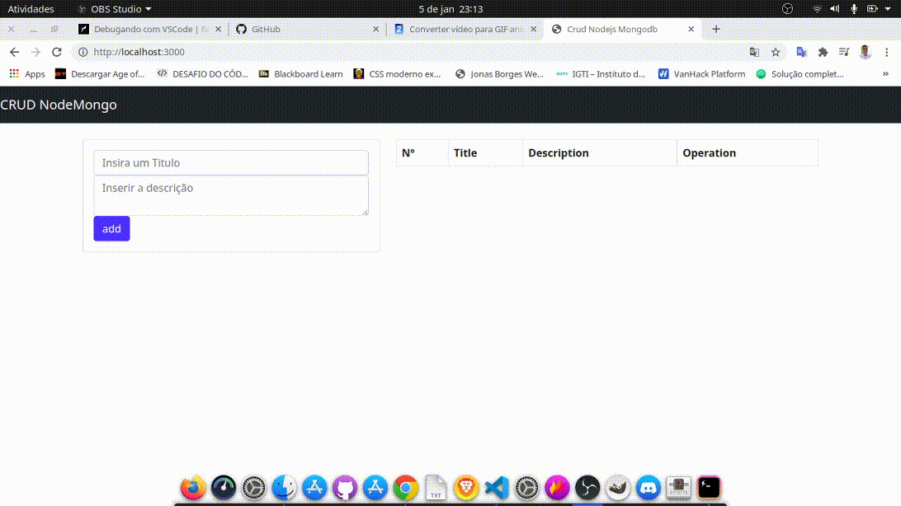

# CRUD - Nodejs e MongoDB

<h1 align="center">
    
</h1><br><br>


  ## 📚 Sobre 

  Esse pequeno CRUD(Create, Read, Update e Delete) foi desenvolvido para estudar o banco de dados MongoDB e por em pratica o que tenho aprendido em javascript e nodejs no lado do Back-end.<br><br>

 <h1 align = center>
    
</h1>

  ## 💻 Tecnologias utilizadas
  - HTML
  - Bootstrap
  - JavaScript
  - Ejs
  - Nodemon
  - Node.Js
  - Express
  - Mongodb
  - Mongoose
  - morgan
  - Npm 

---


## 💻 Como baixar o projeto 

```bash

    # Clonar o repositório atraves GitHub Desktop
    $ git clone https://github.com/NatanSiilva/CRUD-Nodejs-e-MongoDB.git

    # Entrar no diretório
    $ cd CRUD-Nodejs-e-MongoDB

    # Instalar as dependêcias
    $ npm install 

    # Iniciar o projeto
    $  npm start
```


## 💻 Dificuldades 

Minha maior dificuldade foi o fato de não conhecer o banco de dados mongoDB e nunca te lido sobre. No entanto, após dois dias de estudos pegado sobre o mesmo conclui que tinha o conhecimento necessário para iniciar o projeto.

<p align= center>
🐱‍👤 Desenvolvido por <strong>Natanael Silva</strong>   -----   Me adicione no <a href="https://www.linkedin.com/in/natanael-silva-33b374188/"target="_blank">Linkedin</a>
</p>